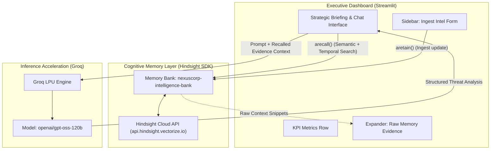

# 🛡️ NexusCorp Competitive Intelligence Agent

An autonomous, executive-grade Competitive Intelligence (CI) system built with **Streamlit**, **Groq**, and the **Hindsight SDK**. 

The system couples real-time reasoning with a persistent cognitive memory bank (`nexuscorp-intelligence-bank`), enabling intelligence officers to track competitor moves, recall chronological evidence across months of strategic developments, and synthesize actionable threats and executive counter-strategies.

---

## 🏛️ System Architecture



---

## ✨ Key Features

- **Persistent Memory Bank (Hindsight SDK)**:
  - Chronological competitor ingestion via `retain`.
  - Contextual, semantic, and temporal historical retrieval via `recall`.
  - Seeded with 10 synthetic March–September 2026 NexusCorp updates tracking key competitor movements (e.g. executive poaching, Series C/D funding rounds, Gartner Magic Quadrant shifts, open-source launches, and the UK CDDO public-sector framework loss).
- **Accelerated Strategic Inference (Groq)**:
  - Powered by `openai/gpt-oss-120b` for rapid reasoning.
  - Native error handling with fallbacks for rate limits (`RateLimitError`), connection drops (`APIConnectionError`), and API status anomalies.
- **Premium Executive UI**:
  - Custom dark theme with dark slate backgrounds (`#0b0f19`, `#151c2e`) and vibrant indigo accents (`#6366f1`).
  - High-level KPI metric cards displaying key threats, pipeline exposure, and tracked entities.
  - Clean `st.form` sidebar ingestion with interactive `st.toast` confirmations.
  - Full Glassmorphic card styling, hover elevation effects, and theme-adaptive text contrast.
- **Robust Async Architecture**:
  - Integrated `nest_asyncio` patching to allow nested event loops within Streamlit's Tornado runtime, preventing event loop collisions and connection pool terminations.

---

## 📁 Project Structure

```text
├── .streamlit/
│   └── config.toml          # Custom dark slate executive theme configuration
├── .env.example             # Template for API keys and endpoint configuration
├── .gitignore               # Ignores .env, virtual environments, and caches
├── app.py                   # Main Streamlit executive dashboard application
├── seed_data.py             # Memory bank seeding script (10 synthetic events)
├── styles.css               # Glassmorphic CSS styling and component layout overrides
└── README.md                # Project documentation
```

---

## 🚀 Getting Started

### 1. Prerequisites

- Python 3.10+ installed
- Groq API Key ([console.groq.com](https://console.groq.com))
- Hindsight API Key & Vectorize Cloud Account ([hindsight.vectorize.io](https://api.hindsight.vectorize.io))

### 2. Installation

Clone the repository:
```bash
git clone https://github.com/Sai-Venkat-Maharajula-2006/Competitive-Intelligence-Agent.git
cd Competitive-Intelligence-Agent
```

Install dependencies:
```bash
pip install streamlit groq hindsight-client python-dotenv nest_asyncio
```

### 3. Environment Configuration

Create a `.env` file in the root directory:
```bash
cp .env.example .env
```

Edit `.env` and insert your credentials:
```env
GROQ_API_KEY=your_groq_api_key_here
HINDSIGHT_API_KEY=your_hindsight_api_key_here
HINDSIGHT_BASE_URL=https://api.hindsight.vectorize.io
```

### 4. Seed the Memory Bank

Run `seed_data.py` to populate the `nexuscorp-intelligence-bank` with 10 chronological intelligence events (March 2026 – September 2026):
```bash
python seed_data.py
```

Expected output:
```text
============================================================
  NexusCorp Intelligence Bank -- Seed Script
  Bank: nexuscorp-intelligence-bank
  Base URL: https://api.hindsight.vectorize.io
  Updates to seed: 10
============================================================

  [OK] [01/10] 2026-03-04 -- stored successfully
  ...
  [OK] [10/10] 2026-09-10 -- stored successfully

============================================================
  Seeding complete: 10 succeeded, 0 failed
============================================================
```

### 5. Launch the Dashboard

Start the Streamlit application:
```bash
streamlit run app.py
```

Access the dashboard in your browser at:
```
http://localhost:8501
```

---

## 💡 Example Queries

Test the intelligence agent with queries that draw upon the persistent memory bank:

- *"What is Synthetix Corp's GovPods strategy and what does it mean for our public-sector sales pipeline?"*
- *"Summarize the risk to our APAC accounts following Priya Mehta's departure to OrbitEdge."*
- *"How should we position against DataVault's open-source VaultCore release?"*
- *"Synthesize all competitive pricing intelligence from Q2 and Q3 2026."*

---

## 🔒 Security & Privacy

- Secret keys are stored strictly in local `.env` files and excluded from source control via `.gitignore`.
- Memory operations are segregated under a dedicated bank namespace (`nexuscorp-intelligence-bank`).
